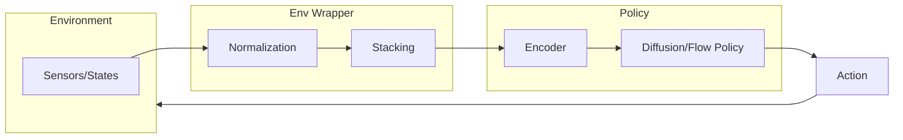

# Robot Learning Architecture

이 문서는 `harness_framework`를 사용하는 로봇 행동 지능 연구 프로젝트의 표준 아키텍처 가이드라인을 담고 있습니다.

## 1. 데이터 흐름 (Data Flow)

## 2. 핵심 컴포넌트

### 2.1 Dataset & Replay Buffer
- **Observation Normalization**: 센서 데이터(이미지, 관절각 등)의 스케일을 조정합니다.
- **Trajectory Sampling**: Diffusion policy 학습을 위해 일정 길이의 궤적을 샘플링합니다.

### 2.2 Policy (Neural Network)
- **Encoder**: 이미지는 Vision Transformer나 ResNet, 상태값은 MLP를 사용하여 임베딩합니다.
- **Noise Predictor (Diffusion)**: 현재 관찰값과 노이즈가 섞인 액션을 입력받아 노이즈를 예측합니다.

### 2.3 Environment Wrapper
- 로봇 물리 엔진(Mujoco, Isaac Gym)과 정책 사이의 인터페이스 역할을 합니다.
- 이전 작업(History)을 쌓아(Stacking) 현재 정책의 입력으로 전달합니다.

### 2.4 Evaluator
- 학습 중 실시간 시뮬레이션 테스트를 수행하여 성공률(Success Rate)을 측정합니다.

## 3. 설정 관리 (Config Management)
- **Hydra**를 사용하여 `task`, `algo`, `env` 설정을 모듈화하여 관리하는 것을 권장합니다.
