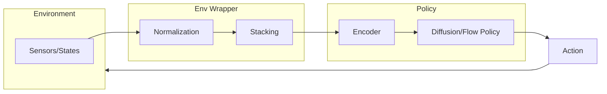

# Robot Learning Architecture

**(placeholder — 실제 프로젝트 아키텍처로 교체할 것)** 아래는 diffusion policy 기반 로봇 학습 파이프라인의 예시 구조입니다. 하네스를 프로젝트에 처음 적용한 뒤, 이 프로젝트의 실제 데이터 흐름·핵심 컴포넌트·설정 관리 방식으로 각 절을 교체하세요.

## 1. 데이터 흐름 (Data Flow)

```mermaid
graph LR
    subgraph Env [Environment]
        S[Sensors/States]
    end
    subgraph Wrapper [Env Wrapper]
        N[Normalization]
        ST[Stacking]
    end
    subgraph Model [Policy]
        EN[Encoder]
        DP[Diffusion/Flow Policy]
    end
    S --> N
    N --> ST
    ST --> EN
    EN --> DP
    DP --> A[Action]
    A --> Env
```

## 2. 핵심 컴포넌트

### 2.1 Dataset & Replay Buffer
- **Observation Normalization**: 센서 데이터(이미지, 관절각 등)의 스케일을 조정합니다.
- **Trajectory Sampling**: Diffusion policy 학습을 위해 일정 길이의 궤적을 샘플링합니다.

### 2.2 Policy (Neural Network)
- **Encoder**: 이미지는 Vision Transformer나 ResNet, 상태값은 MLP를 사용하여 임베딩합니다.
- **Noise Predictor (Diffusion)**: 현재 관찰값과 노이즈가 섞인 액션을 입력받아 노이즈를 예측합니다.

### 2.3 Environment Wrapper
- 로봇 물리 엔진(Mujoco, Isaac Gym)과 정책 사이의 인터페이스 역할을 합니다.
- 이전 작업(History)을 쌓아(Stacking) 현재 정책의 입력으로 전달합니다.

### 2.4 Evaluator
- 학습 중 실시간 시뮬레이션 테스트를 수행하여 성공률(Success Rate)을 측정합니다.

## 3. 설정 관리 (Config Management)
- **Hydra**를 사용하여 `task`, `algo`, `env` 설정을 모듈화하여 관리하는 것을 권장합니다.

## 4. 실행 환경
실제 하드웨어 구성(PC 대수, GPU 유무 등)은 `docs/private/ENVIRONMENT.md`(git 미추적, 로컬 전용)에 기록한다. 이 문서(`ARCHITECTURE.md`)는 이 하네스를 쓰는 프로젝트가 public 레포일 수 있으므로, 인프라 정보는 여기 두지 않는다. 구성과 무관하게, 디바이스 하드코딩 대신 CPU/GPU fallback(`device='cuda' if torch.cuda.is_available() else 'cpu'` 등)을 유지하면 안전하다.
